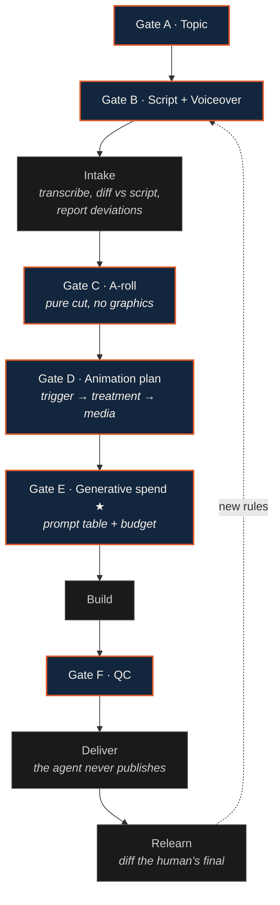

# Showrunner

**An approval-gate architecture for running a video show with an AI agent.**

The agent does production. A human stays the showrunner — holding direction,
cost and taste.

[](LICENSE)


---

## The problem

Generative models can now produce video assets faster than a human can review
them, and they bill for every attempt — including the failures. Put an agent
in charge of a real show and three things go wrong at once:

- **Cost drifts.** Nobody decided to spend it; it accumulated one batch at a time.
- **Look drifts.** Every generated shot is individually plausible and collectively incoherent.
- **Judgment drifts.** The agent decorates everything, because "make it engaging" has no stopping rule.

None of these are model-quality problems, so better prompts don't fix them.
They are **process** problems. Showrunner is the process.

## What this is

Six specification documents an AI coding agent loads as operating
instructions. They encode five transferable patterns:

| | Pattern | Solves |
|---|---|---|
| **1** | [Approval gates](framework/01-gates.md) | Where the agent must stop — including a **hard gate on generative spend** |
| **2** | [Learning loop](framework/02-learning-loop.md) | Turning corrections into durable rules, without the agent overruling you |
| **3** | [Trigger table](framework/03-trigger-table.md) | Editorial judgment as an executable decision table, with a default of *nothing* |
| **4** | [Visual consistency](framework/04-visual-consistency.md) | Making a set of AI shots look like one show |
| **5** | [Compliance](framework/05-compliance.md) | AI disclosure, media licensing tiers, editorial risk |

Plus [QC](framework/06-qc.md): what a machine checks versus what a human must read aloud.

This is **not** a rendering tool, an NLE, or a model wrapper. It sits above
whatever stack you already use and decides when the human is in the loop.

## Architecture



Dark boxes are gates: the agent **stops** and cannot proceed. Everything
between them is the agent's to do without asking.

## The gate that matters most

Most teams building agent workflows implement none of these. If you implement
exactly one, make it **Gate E**:

> No AI image or video is generated without explicit, per-batch human
> approval — and generation happens *last*, after all real footage and all
> animation are finished.

The ordering is the trick. Most "we need AI footage here" turns out to be "we
haven't finished looking for real footage yet." Forcing generation to the end
of the pipeline collapses the volume requested, and what remains is better
specified. Generation is usually the only *metered* step in an AI editing
stack — gating it converts an open-ended API bill into a reviewed line item
without slowing anything else down.

## The safety property

A self-modifying instruction set needs a constraint, or it will quietly
reverse decisions you made deliberately — each contradiction looks locally
reasonable when resolved in the moment.

> **The agent may learn. It may not silently overrule you.**
>
> It can add rules, generalize several into one, and refine wording. It
> **cannot** overturn a human decision, resolve a contradiction between specs
> on its own, or drop a rule as obsolete. Contradictions escalate — always.

Deliberate exceptions are recorded rather than quietly executed, scoped to one
episode, and carry an explicit prohibition on generalizing themselves. See
[`02-learning-loop.md`](framework/02-learning-loop.md).

## Quickstart

```bash
git clone https://github.com/liuyuze1012-code/showrunner.git
cd showrunner
cp config.example.yml config.local.yml   # gitignored — your IDs stay local
```

Then:

1. **Fill in `config.local.yml`** — brand tokens, format, budget, tool paths.
2. **Install as an agent skill.** For Claude Code, symlink or copy into
   `~/.claude/skills/showrunner/`. Any agent that loads Markdown instructions
   works — `SKILL.md` is the entry point and routes to the rest.
3. **Decide your gates.** Defaults are in `config.local.yml`. Disabling one
   should be a deliberate act.
4. **Write your show skill.** Showrunner is deliberately show-agnostic; brand,
   layout and components live alongside it. Start from
   [`reference-impl/space101/`](reference-impl/space101/).
5. **Run one episode and keep an inbox.** The first run generates the rules
   the framework can't know for you.

### Adapting the trigger table
Don't write it from aspiration. Go through work that got **rejected** — each
rejection is a trigger you hadn't written down. Order rows by strength so the
agent knows which wins when two fire. Include the *do-nothing* rows
explicitly, or silence never gets chosen.

## Reference implementation

[`reference-impl/space101/`](reference-impl/space101/) documents
**太空101 (Space 101)** — a Chinese-language frontier-technology explainer
series — as a complete worked example: a three-skin brand system, a
ten-component motion-graphics library, a locked AI diorama recipe, and a
case-study breakdown of one shipped 4K episode.

Reference material is deliberately kept separate from `framework/`. The
framework is the part you reuse; the reference implementation is the part you
replace.

## Provenance

These patterns were extracted from a working production channel, not designed
in the abstract. The originating specification set went through **40 commits
over six weeks** and **~91 numbered production learnings**, one of which —
collapsing 56 individual corrections into a single 12-row decision table — is
the reason the trigger table exists in this form.

Where a rule looks oddly specific, it is because something broke. Those are
the valuable ones.

## Scope and limits

Worth being explicit about:

- **This is a process framework, not software.** There is nothing to execute.
  Its value is in what the agent reads before acting.
- **It assumes a capable coding agent** with filesystem and tool access.
- **The compliance layer is China-platform-weighted**, because that is where
  it was built and tested. The licensing tiers and disclosure logic generalize;
  the specific regulation cited does not.
- **Tool-agnostic by design, but not tool-free.** You need an editor an agent
  can drive, a rendering path, and ASR. Record verified values in config so
  they are never rediscovered.
- **Single-show, single-director.** Multi-stakeholder approval is not modeled.

## Contributing

Patterns that generalize are welcome — especially gate designs, compliance
rules for other jurisdictions, and trigger tables from different editorial
voices. See [CONTRIBUTING.md](CONTRIBUTING.md).

## License

[MIT](LICENSE) © 2026 Yuze (Gavin) Liu
